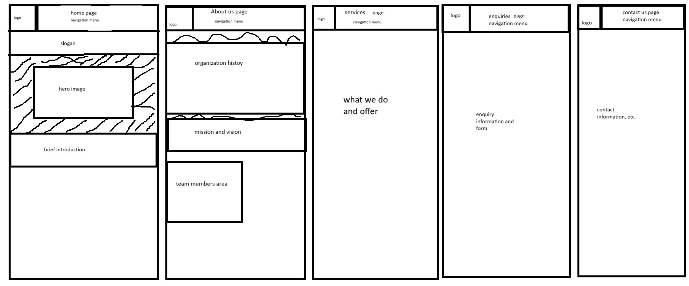
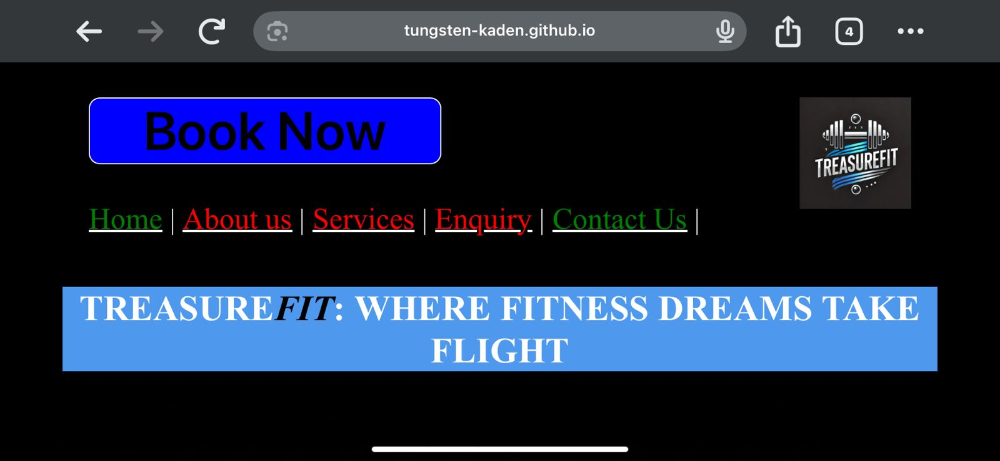
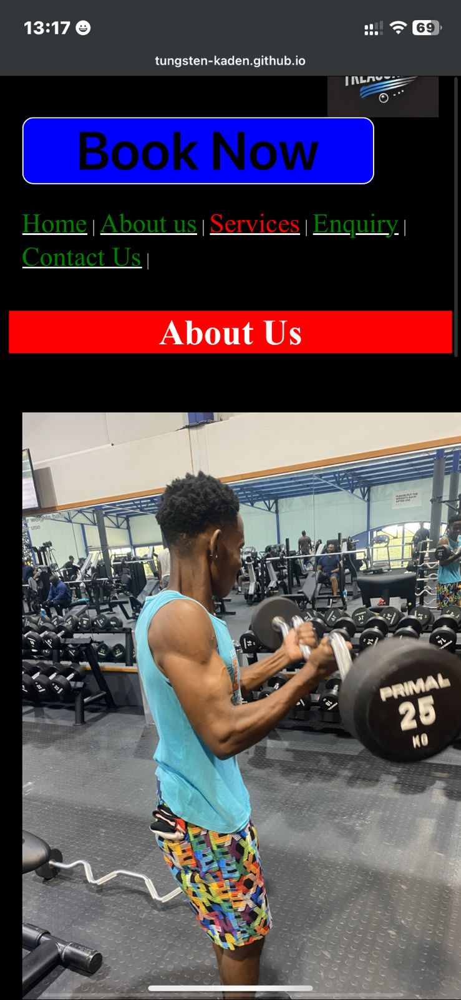
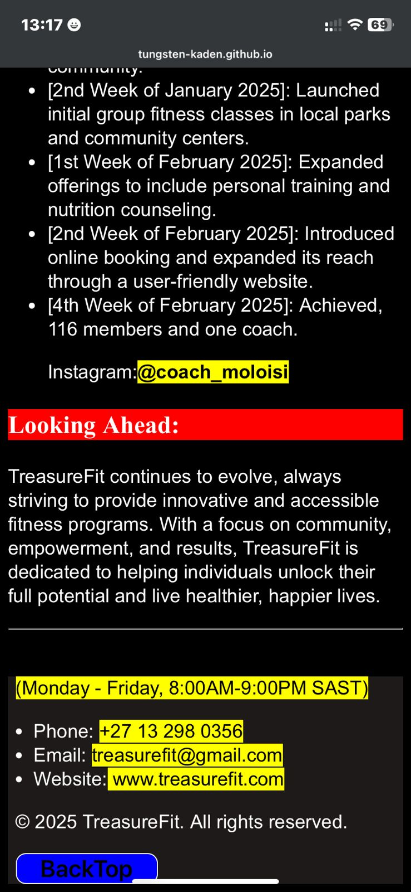
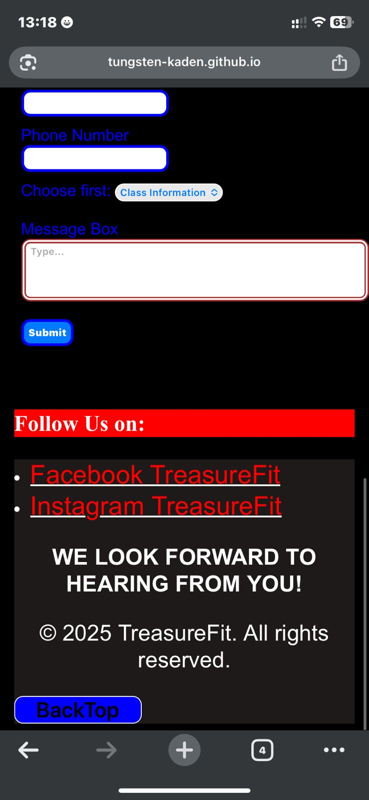
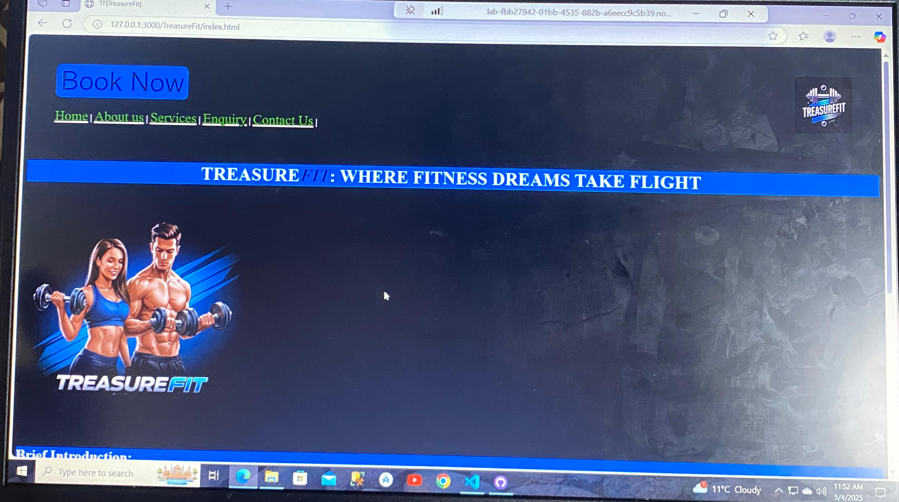
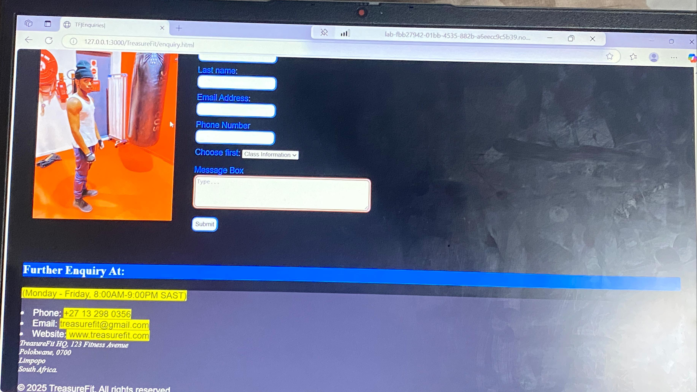

# ChangeLog
## Name of Organisation:
 TreasureFit

## Project Title: 
TreasureFit

# Student Information:
### Name & Surname: Treasure Lesinya
### Student Number: ST10470002
### Subject Name: Web Development (introduction)
### Subject Code: WEDE5020

## Website Goals: 
### 1st goal= Attract clients and create awareness
### 2nd goal= make it easy for clients to book class and enquire
## key features:
### online classes, content library, community forum
## Sitemap:

## Added Css and linked it
Name of style sheet is styl.css

## Css added:
most elements have a consistent styling throughout the html pages.

## Below is evidence that my website is responsive to all devices, including mobile, desktop, laptop and tablet:
### For Mobile:

### For Laptop and desktop

## JavaScript added
Code snippets to edit my website have been added. Now my website is functional and interactive

## Sitemap has been added
[Title](sitemap.xml)

## Robots.txt for search engine crawlers
[Title](Robots.txt)